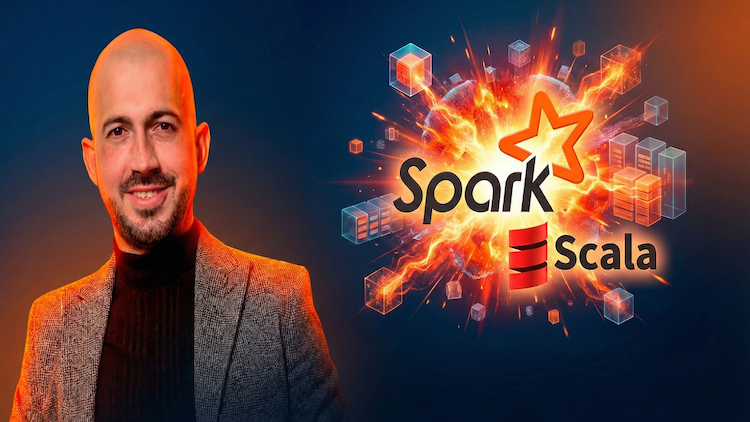

# Spark y Scala en Databricks: Big Data e ingeniería de datos

> **Trabajo desde niveles básicos hasta avanzados con RDD y DataFrame.**

---

## Sobre este repositorio

Bienvenido al repositorio oficial del curso **Spark y Scala en Databricks: Big Data e ingeniería de datos**. 

Este material está diseñado para acompañarte en el aprendizaje de **Scala-Spark**, combinando la teoría con la práctica directa en la nube. Spark es el sistema distribuido por excelencia para procesar grandes volúmenes de datos de manera eficiente, y aquí aprenderás a dominar sus abstracciones principales: **RDDs** y **DataFrames**.

### Enfoque del curso
El contenido sigue una estructura **progresiva y gradual**. Está pensado tanto para quienes desean iniciarse en el mundo del Big Data, como para profesionales que buscan consolidar conocimientos y aprender técnicas de **optimización de aplicaciones**.

**Lo que encontrarás aquí:**
* Fundamentos de Big Data y arquitectura Spark.
* Configuración y uso de **Databricks**.
* Dominio práctico de **RDDs** (Resilient Distributed Datasets).
* Procesamiento avanzado con **DataFrames**.
* Técnicas para mejorar y optimizar implementaciones existentes.

👉 **[Accede al curso completo en Udemy](https://www.udemy.com/course/spark-y-scala-en-databricks-big-data-e-ingenieria-de-datos/?referralCode=26A5490540622567AE88)**

---

## Estructura del contenido

El repositorio está organizado para permitirte localizar rápidamente el contenido de cada lección. La mayoría de los scripts incluyen tanto la parte teórica explicada en video como la implementación práctica.

* **📂 Sección 2:** Primeros pasos y configuración en Databricks.
* **📂 Secciones 3 - 6:** Trabajo profundo con **RDDs** (Transformaciones, Acciones y Persistencia).
* **📂 Secciones 7 - 9:** Trabajo avanzado con **Spark SQL y DataFrames**.

---

## Entorno de Trabajo

Para seguir este curso no necesitas una instalación local compleja. Nos enfocaremos en el uso de la nube:

1.  **Plataforma:** Usaremos **Databricks**.
2.  **Lenguaje:** Scala (Nativo de Spark).
3.  **Ejecución:** Notebooks interactivos.

---

## Instrucciones de uso

Los archivos de este repositorio están listos para ser llevados a tu entorno de Databricks:

1.  **Archivos `.ipynb` (Notebooks):**
    * Ideales para importar directamente en tu Workspace de Databricks (*Import > From File*).
2.  **Archivos `.scala` (Scripts):**
    * Contienen el código fuente de las lecciones.
    * Simplemente copia el contenido y pégalo en una celda de tu notebook en Databricks para ejecutarlo.

---

## 🤝 Contribuciones y Soporte

Este material es complementario al curso en video.
* Si tienes dudas sobre los conceptos, por favor usa la sección de **Preguntas y Respuestas (Q&A)** en Udemy.
* Si encuentras un error en el código, ¡siéntete libre de abrir un *Issue* o un *Pull Request*!

---
Hecho con ❤️ por **José Miguel Moya Curbelo** | Instructor de Big Data & Ingeniería de Datos